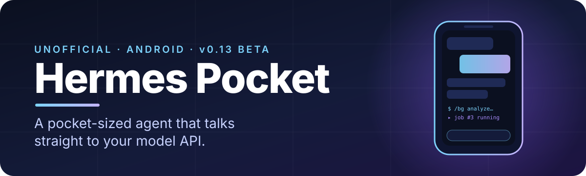
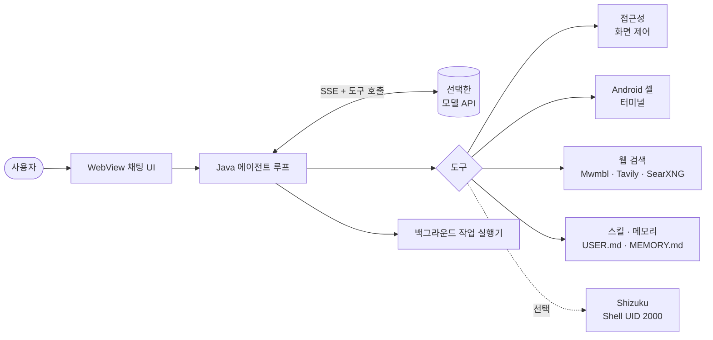

<div align="center">



[English](README.md) · **한국어**

<br>


[**소개**](#-소개) ·
[**기능**](#-기능) ·
[**구조**](#-구조) ·
[**빌드**](#-빌드) ·
[**현황**](#-솔직한-현황) ·
[**문서**](#-문서)

</div>

<br>

## ✦ 소개

**Hermes Pocket**은 [Nous Research의 Hermes Agent](https://github.com/NousResearch/hermes-agent)에서 영감을 받은 Android 에이전트입니다.
원하는 모델 API를 연결하면 대화 UI, 도구 선택·실행, 사용자 승인, 기기 제어, 메모리와 기록까지
에이전트 루프 전체를 **휴대폰 안에서** 처리합니다.

앱을 실행하는 데 PC, 중계 서버, 별도 Python 런타임이 필요 없습니다.

> [!IMPORTANT]
> Hermes Pocket은 **비공식 개인 프로젝트**이며, 원본 Hermes Python 엔진을 통째로 이식한 앱이 **아닙니다**.
> 자체 Java 에이전트 루프를 사용합니다. 무엇이 구현됐고 무엇이 아닌지는 [솔직한 현황](#-솔직한-현황)을 확인하세요.

<br>

## ✦ 기능

<table>
<tr>
<td width="50%" valign="top">

### 🤖 에이전트
- 모델 API 직접 연결 (SSE 스트리밍 + 함수 호출)
- 모델 선택, 생각 수준 선택 (`minimal` → `ultra`)
- 모델이 직접 만드는 재사용 `SKILL.md` 스킬과 메모리
- Hermes 방식의 긴 대화 문맥 압축

</td>
<td width="50%" valign="top">

### 📱 기기 제어
- 접근성 기반 화면 읽기·탭·스크롤·앱 조작
- 실제 Android 셸 터미널
- 선택 사항: [Shizuku](https://shizuku.rikka.app/) 도우미 (Shell UID 2000, Root **아님**)
- 작업별 승인 또는 자동 승인

</td>
</tr>
<tr>
<td width="50%" valign="top">

### ⚡ 백그라운드 작업
- 채팅과 별도로 읽기 전용 모델 작업 실행
- 동시 실행 **최대 2개**, 대기 포함 **최대 8개**
- 연결·대화·중단·결과를 작업별로 분리해 저장
- 다른 앱 사용 중 작은 팝업 표시

</td>
<td width="50%" valign="top">

### 🎨 모바일 우선 UI
- 화이트·블랙 두 가지 테마
- Markdown, 표, 코드 복사
- 접어서 보는 스킬·메모리 문서 목록
- 간결한 도구 진행·생각 표시

</td>
</tr>
</table>

### 백그라운드 작업 명령어

```text
/help                 명령어 목록
/status               앱·모델 상태 확인
/bg <작업>             독립된 읽기 전용 작업 시작
/jobs                 작업 목록
/result <작업ID>       완료된 작업 결과 보기
/cancel <작업ID>       작업 취소
/stop                 현재 실행 중지
```

<br>

## ✦ 구조



자세한 설명: [docs/ko/architecture.md](docs/ko/architecture.md)

<br>

## ✦ 빌드

`hermes-android/`에서 실행합니다. **Linux x86_64**, Tkinter가 포함된 **Python 3.10+**, **JDK 17 또는 21**이 필요합니다.
Android API 35와 Build Tools 35.0.0은 처음 실행할 때 Google 공식 저장소에서 내려받습니다.

```bash
cd hermes-android
python3 scripts/build_gui.py
```

빌드에 성공하면 `dist/hermes-pocket-v0.13.apk`, `dist/signature-verification.txt`, `dist/build-info.json`이 생성됩니다.

> [!WARNING]
> 개발용 서명 키는 `.signing/`에 만들어집니다. 앱을 **업데이트**하려면 같은 키를 보관해야 하며,
> 절대 업로드하거나 공유하지 마세요.

**모델 연결:** *메뉴 → 설정 → 모델 설정*에서 제공업체를 고르고 API 키를 저장한 뒤, 모델을 불러오거나 ID를 입력하고 생각 수준을 선택한 다음 연결을 테스트합니다.
엔진은 SSE와 함수 호출을 쓰는 `/chat/completions`를 사용하므로 제공업체와 모델이 이 형식을 지원해야 합니다.
API 사용량에 따라 비용이 발생할 수 있습니다.

<br>

## ✦ 솔직한 현황

| 영역 | 상태 |
|---|---|
| Java 에이전트 루프, 도구, WebView UI | ✅ 배포됨 |
| v0.13을 실제 기기에 설치·실행 | ✅ 확인됨 (해시·버전·프로세스) |
| 독립 백그라운드 작업 | ✅ 배포됨 |
| 원본 스킬 210개 포함 | ✅ 209개 가져오기 가능, 1개는 파일 1 MiB 한도 초과 |
| 원격 API + 브라우저 + 백그라운드 + 팝업 종합 검증 | ⏳ 아직 안 함 |
| 에뮬레이터 의미 기반 접근성 클릭 | ⚠️ 미검증 (전제 조건 실패) |
| APK 안의 원본 Hermes Python 엔진 | ❌ 실험 단계, 메인 APK에는 없음 |
| `execute_code`/PTY, MCP·플러그인 전체, cron, gateway, OAuth, 음성·미디어 생성 | ❌ 미구현 |
| Root (UID 0) | ❌ 부여되지 않음 |

설치 성공이나 문서 개수만으로 기능이 "동작한다"고 쓰지 않습니다.
자세한 내용과 근거: [docs/ko/status.md](docs/ko/status.md)

<br>

## ✦ 문서

| | English | 한국어 |
|---|---|---|
| 아키텍처 | [architecture](docs/en/architecture.md) | [아키텍처](docs/ko/architecture.md) |
| 프로젝트 현황 | [status](docs/en/status.md) | [현황](docs/ko/status.md) |
| 저장소 구조 | [layout](docs/en/repository-layout.md) | [저장소 구조](docs/ko/repository-layout.md) |
| 문서 목차 | [index](docs/en/documentation-index.md) | [문서 목차](docs/ko/documentation-index.md) |

[`hermes-android/docs/`](hermes-android/docs/)의 상세 개발 문서는 대부분 한국어로 작성돼 있습니다.

<br>

## ✦ 출처와 라이선스

- Hermes Pocket은 [MIT 라이선스](hermes-android/LICENSE)로 공개됩니다.
- [Nous Research Hermes Agent](https://github.com/NousResearch/hermes-agent)(MIT, © 2025 Nous Research)에서 영감을 받은 비공식 통합이며, Nous Research의 공식 릴리스가 아닙니다.
- Hermes 마스코트는 원본 저장소의 이미지를 수정 없이 포함했습니다. [이미지 출처](hermes-android/docs/HERMES_ASSETS.md)와 [UPSTREAM.md](hermes-android/UPSTREAM.md)를 참고하세요.
- Android SDK와 JDK 바이너리는 포함하지 않으며 각자의 라이선스를 따릅니다.
