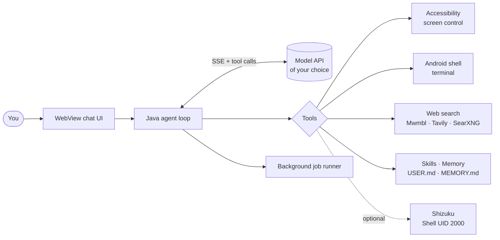

<div align="center">


**English** · [한국어](README.ko.md)

<br>


[**Overview**](#-overview) ·
[**Features**](#-features) ·
[**Architecture**](#-architecture) ·
[**Build**](#-build) ·
[**Status**](#-honest-status) ·
[**Docs**](#-documentation)

</div>

<br>

## ✦ Overview

**Hermes Pocket** is an Android agent inspired by [Nous Research's Hermes Agent](https://github.com/NousResearch/hermes-agent).
You connect it to a model API of your choice, and it runs the whole agent loop **on the phone itself**:
chat UI, tool selection and execution, user approvals, device control, memory, and history.

No PC, no relay server, and no bundled Python runtime is required to run the app.

> [!IMPORTANT]
> Hermes Pocket is an **unofficial personal project**. It is **not** a full port of the Hermes Python engine.
> It uses its own Java agent loop. See [Honest status](#-honest-status) for exactly what ships and what does not.

<br>

## ✦ Features

<table>
<tr>
<td width="50%" valign="top">

### 🤖 Agent
- Direct model API connection (SSE streaming + function calling)
- Model picker and thinking-level picker (`minimal` → `ultra`)
- Self-written, reusable `SKILL.md` skills and memory
- Hermes-style context compaction for long chats

</td>
<td width="50%" valign="top">

### 📱 Device control
- Accessibility-based screen reading, tap, scroll, app control
- Real Android shell terminal
- Optional [Shizuku](https://shizuku.rikka.app/) helper (Shell UID 2000, **not** root)
- Per-action approval or auto-approval

</td>
</tr>
<tr>
<td width="50%" valign="top">

### ⚡ Background jobs
- Run read-only model jobs next to your chat
- Up to **2 in parallel**, **8 queued**
- Independent connection, history, cancel, and saved results
- Floating popup while you use other apps

</td>
<td width="50%" valign="top">

### 🎨 Mobile-first UI
- White and black themes
- Markdown, tables, code copy
- Collapsible skill / memory document lists
- Compact tool-progress and thinking display

</td>
</tr>
</table>

### Slash commands for background jobs

```text
/help                 list commands
/status               show app and model status
/bg <task>            start an independent read-only job
/jobs                 list jobs
/result <job-id>      read a finished job
/cancel <job-id>      cancel a job
/stop                 stop the current run
```

<br>

## ✦ Architecture



More detail: [docs/en/architecture.md](docs/en/architecture.md)

<br>

## ✦ Build

Run from `hermes-android/`. Requires **Linux x86_64**, **Python 3.10+** with Tkinter, and **JDK 17 or 21**.
Android API 35 and Build Tools 35.0.0 are downloaded from Google's official repository on first run.

```bash
cd hermes-android
python3 scripts/build_gui.py
```

A successful build produces `dist/hermes-pocket-v0.13.apk`, `dist/signature-verification.txt` and `dist/build-info.json`.

> [!WARNING]
> The development signing key is created under `.signing/`. Keep it to be able to **update** the app,
> and never upload or share it.

**Connect a model:** open *Menu → Settings → Model settings*, pick a provider, save your API key, load or type a model ID, choose a thinking level, then test the connection.
The engine uses `/chat/completions` with SSE and function calling, so the provider and model must support that format.
API usage may incur costs.

<br>

## ✦ Honest status

| Area | State |
|---|---|
| Java agent loop, tools, WebView UI | ✅ Shipped |
| v0.13 installed and launched on a real device | ✅ Verified (hash, version, process) |
| Independent background jobs | ✅ Shipped |
| 210 upstream skills bundled | ✅ 209 importable, 1 over the 1 MiB file limit |
| Full-system test with remote API + browser + background + popup together | ⏳ Not done yet |
| Semantic accessibility click on emulator | ⚠️ Not verified (precondition failed) |
| Original Hermes Python engine in the APK | ❌ Experiment only, not in the main APK |
| `execute_code`/PTY, full MCP/plugins, cron, gateway, OAuth, voice and media generation | ❌ Not implemented |
| Root (UID 0) | ❌ Not granted |

Passing an install or a document count is never reported as a feature "working".
Details and evidence: [docs/en/status.md](docs/en/status.md)

<br>

## ✦ Documentation

| | English | 한국어 |
|---|---|---|
| Architecture | [architecture](docs/en/architecture.md) | [아키텍처](docs/ko/architecture.md) |
| Project status | [status](docs/en/status.md) | [현황](docs/ko/status.md) |
| Repository layout | [layout](docs/en/repository-layout.md) | [저장소 구조](docs/ko/repository-layout.md) |
| Document index | [index](docs/en/documentation-index.md) | [문서 목차](docs/ko/documentation-index.md) |

Most in-depth engineering notes under [`hermes-android/docs/`](hermes-android/docs/) are written in Korean.

<br>

## ✦ Credits & license

- Hermes Pocket is released under the [MIT License](hermes-android/LICENSE).
- It is an unofficial integration inspired by [Nous Research Hermes Agent](https://github.com/NousResearch/hermes-agent) (MIT, © 2025 Nous Research). It is not an official Nous Research release.
- The Hermes mascot is bundled unmodified from the upstream repository. See [image attribution](hermes-android/docs/HERMES_ASSETS.md) and [UPSTREAM.md](hermes-android/UPSTREAM.md).
- Android SDK and JDK binaries are not included; their own licenses apply.
