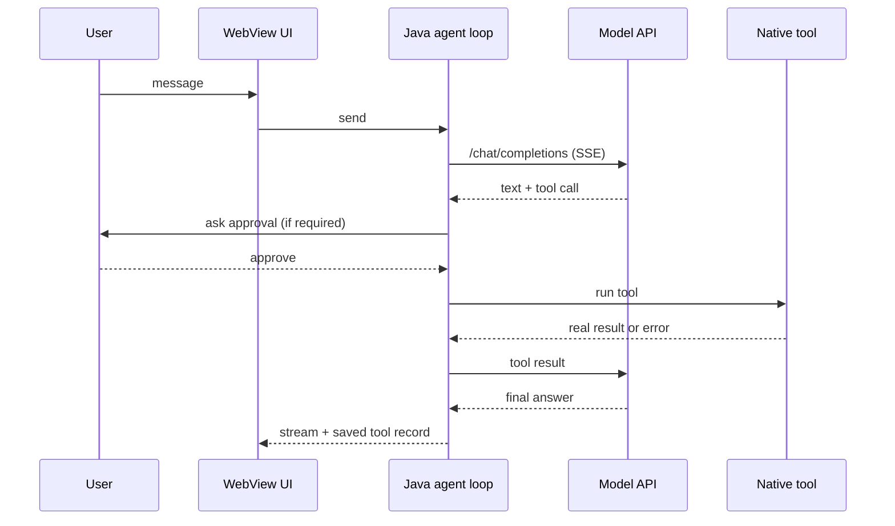

# Architecture

[← Back to README](../../README.md) · **English** · [한국어](../ko/architecture.md)

Hermes Pocket is a self-contained Android app. Everything except the model call and optional web search happens on the phone.

## Layers

| Layer | What it does |
|---|---|
| **WebView UI** | Chat, settings, themes, Markdown, tool-progress display (`app/src/main/assets/`) |
| **Java agent loop** | Sends messages to the model, receives streamed tool calls, runs tools, feeds results back |
| **Native tools** | Accessibility screen control, Android shell terminal, intents, files, web search, memory, skills |
| **Job runner** | Independent read-only model jobs: max 2 running, max 8 running or queued |
| **Storage** | Conversations, tool-run records, memory and skills; model and search keys are encrypted separately |

## Request flow

## Design rules

- **Real results only.** A tool run is reported as completed only when the real result says so. Unverified or interrupted records are never shown as "running".
- **Approvals are explicit.** Full-device scope and auto-approve versus ask-each-time are separate choices.
- **Sensitive screens are protected.** Authentication, permission and unknown system screens are not read or operated.
- **Background jobs are read-only.** Workers have no screen, browser, shell, MCP, or recursive delegation.
- **Keys are separated.** Model keys and web-search keys are encrypted independently; switching provider clears the previous provider's credentials.

## Not part of this architecture (yet)

The upstream Hermes Python `AIAgent`, `execute_code`/PTY, full MCP/plugin execution, cron, gateway, OAuth/failover and voice are **not** embedded in the APK. An on-device Python experiment lives in `hermes-android/engine-spike/` and is a separate test app.

See [status.md](status.md) for evidence and limits.
