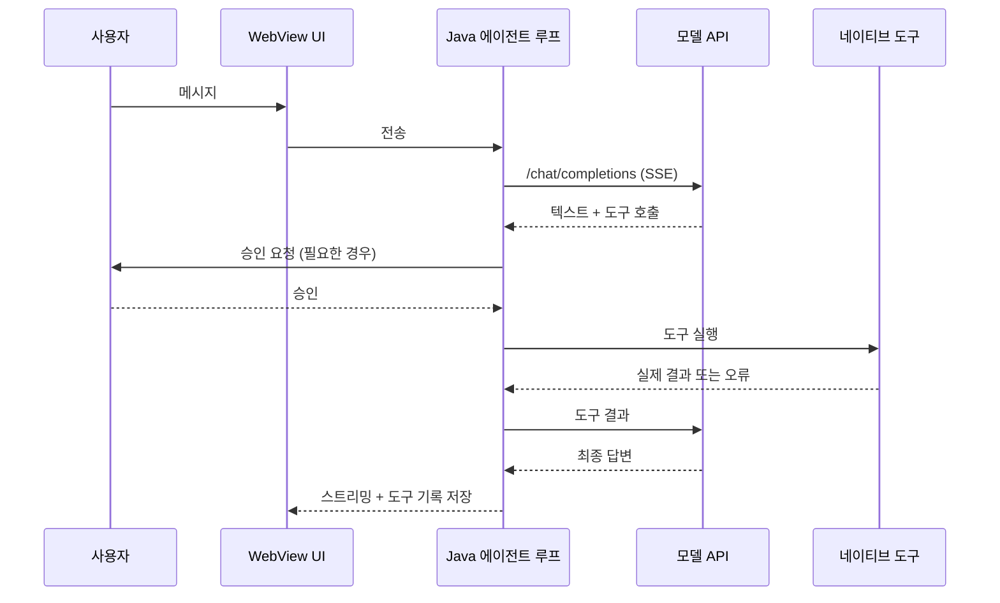

# 아키텍처

[← README로](../../README.ko.md) · [English](../en/architecture.md) · **한국어**

Hermes Pocket은 자체 완결형 Android 앱입니다. 모델 호출과 선택적 웹 검색을 제외한 모든 처리는 휴대폰에서 이루어집니다.

## 계층

| 계층 | 역할 |
|---|---|
| **WebView UI** | 채팅, 설정, 테마, Markdown, 도구 진행 표시 (`app/src/main/assets/`) |
| **Java 에이전트 루프** | 모델에 메시지를 보내고, 스트리밍된 도구 호출을 받아 실행한 뒤 결과를 다시 전달 |
| **네이티브 도구** | 접근성 화면 제어, Android 셸 터미널, 인텐트, 파일, 웹 검색, 메모리, 스킬 |
| **작업 실행기** | 독립된 읽기 전용 모델 작업. 동시 실행 최대 2개, 실행·대기 합쳐 최대 8개 |
| **저장소** | 대화, 도구 실행 기록, 메모리·스킬. 모델 키와 검색 키는 분리해 암호화 |

## 요청 흐름

## 설계 원칙

- **실제 결과만 표시합니다.** 도구 실행은 실제 결과가 확인될 때만 완료로 표시하며, 확인되지 않은 중단 기록을 "실행 중"이라고 단정하지 않습니다.
- **승인은 명시적입니다.** 전체 기기 범위와 자동 승인·승인 요청은 따로 선택합니다.
- **민감한 화면은 보호합니다.** 인증·권한·알 수 없는 시스템 화면은 읽거나 조작하지 않습니다.
- **백그라운드 작업은 읽기 전용입니다.** 작업자는 화면·브라우저·셸·MCP·재귀 위임을 쓸 수 없습니다.
- **키는 분리합니다.** 모델 키와 웹 검색 키는 따로 암호화하고, 제공업체를 바꾸면 이전 업체의 인증 정보를 초기화합니다.

## 아직 이 구조에 포함되지 않은 것

원본 Hermes Python `AIAgent`, `execute_code`/PTY, MCP·플러그인 전체 실행, cron, gateway, OAuth/failover, 음성은 APK에 포함돼 있지 **않습니다**. 기기 안 Python 실험은 `hermes-android/engine-spike/`에 있으며 별도의 시험 앱입니다.

근거와 제한은 [status.md](status.md)를 참고하세요.
